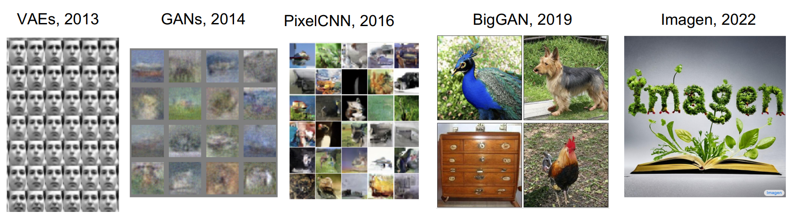
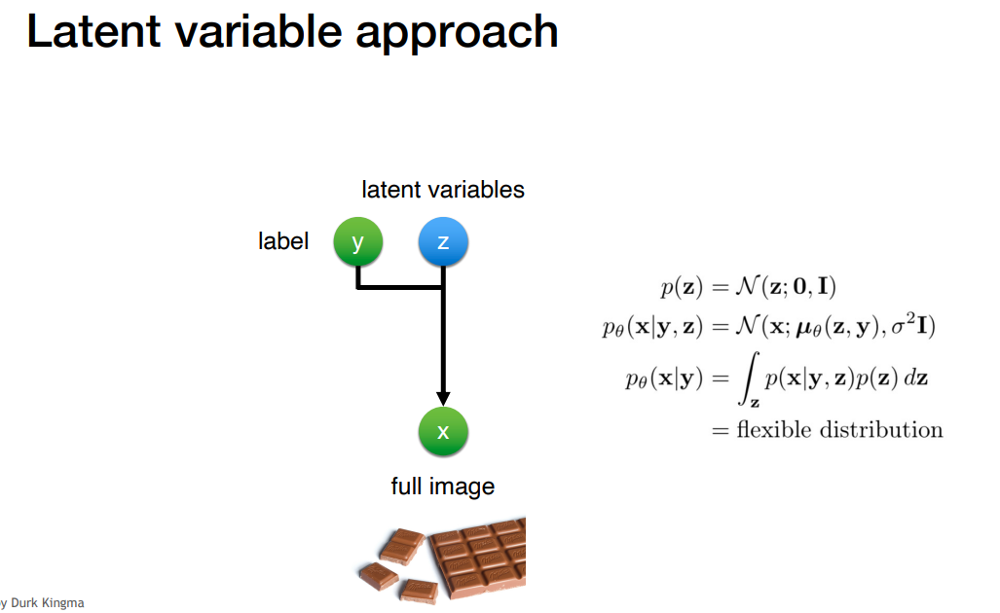
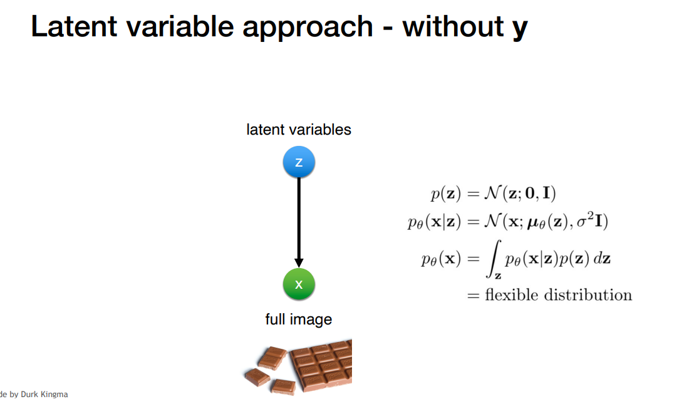
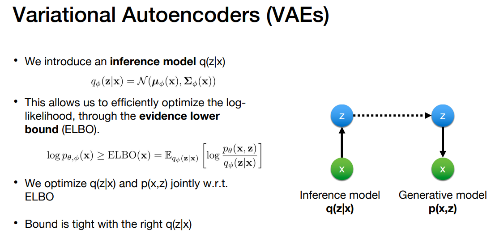
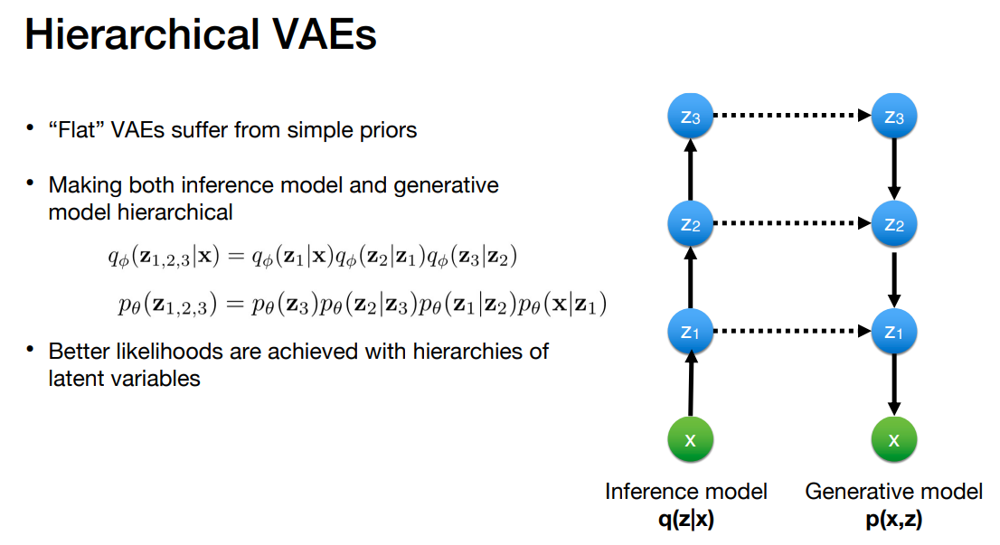
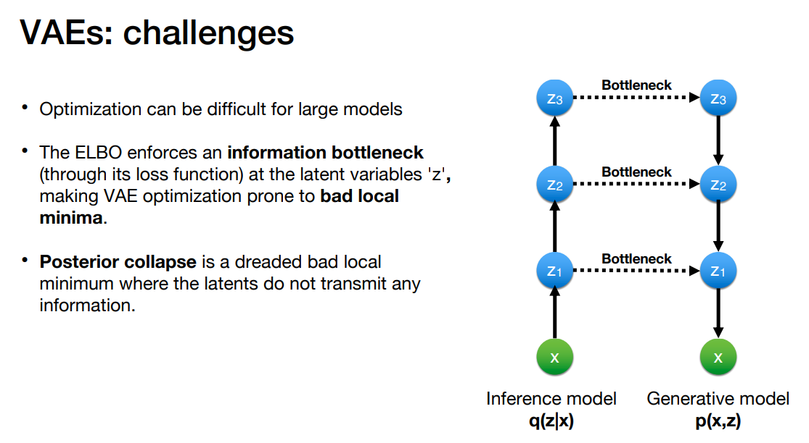

# Topic 2: Deep Generative Models

## 0. Table of Contents

- [1. Variational Autoencoders](#1-variational-autoencoders)

- [Reference](#reference)

## 1. Variational Autoencoders

- __Problem__: Marginal likelihood $p(x)$ is intractable. So can’t do maximum likelihood directly.

## Reference

- [1] [CS231n: Deep Learning for Computer Vision](http://cs231n.stanford.edu/index.html)