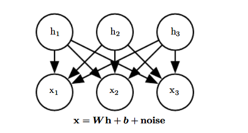

# Topic 5: Linear Factor Models

## 0. Table of Contents

- [Reference](#reference)

## Reference

- [1] Kevin P. Murphy. 2022. [Probabilistic Machine Learning: An introduction](https://probml.github.io/pml-book/book1.html). MIT Press.
- [2] [CS229: Machine Learning](https://cs229.stanford.edu/notes2022fall/main_notes.pdf)