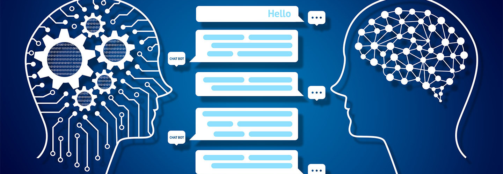
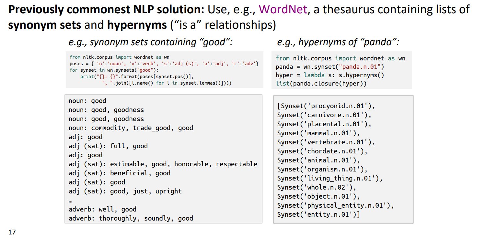

# Topic 3: Natural Language Processing with Deep Learning

## 0. Table of Contents

- [1. Word Vectors](#1-word-vectors)

- [Reference](#reference)

## 1. Word Vectors

- Problems with resources like `WordNet`  
    - A useful resource but missing nuance: 
        - e.g., “proficient” is listed as a synonym for “good”. This is only correct in some contexts 
        - Also, WordNet list offensive synonyms in some synonym sets without any coverage of the connotations or appropriateness of words 
    - Missing new meanings of words: 
        - e.g., wicked, badass, nifty, wizard, genius, ninja, bombest 
        - Impossible to keep up-to-date! 
    - Subjective 
    - Requires human labor to create and adapt 
    - Can’t be used to accurately compute word similarity

- In traditional NLP, we regard words as discrete symbols. Such symbols for words can be represented by one-hot vectors. However, there is no natural notion of similarity for one-hot vectors.

- Representing words by their context: 
    - Distributional semantics: A word’s meaning is given by the words that frequently appear close-by
    - When a word w appears in a text, its context is the set of words that appear nearby (within a fixed-size window).

## Reference

- [1] [CS224N: Natural Language Processing with Deep Learning](https://web.stanford.edu/class/cs224n/index.html#schedule)