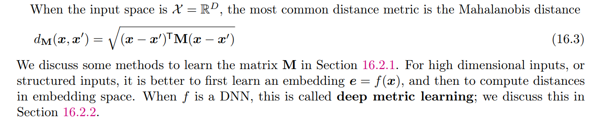
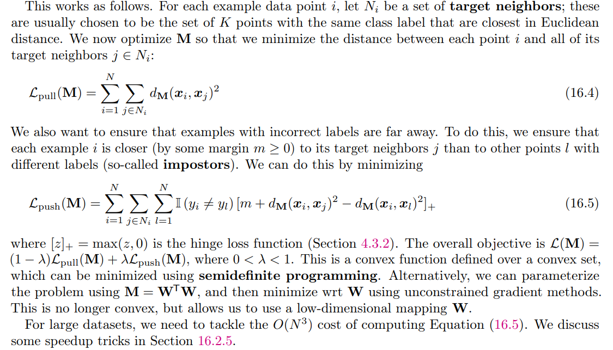
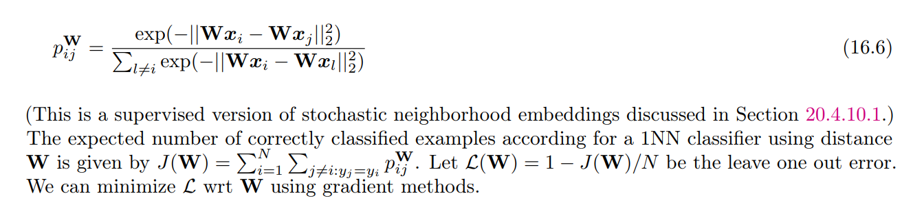
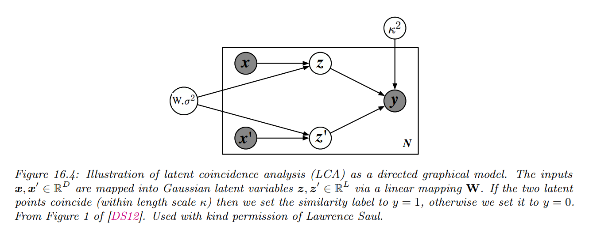
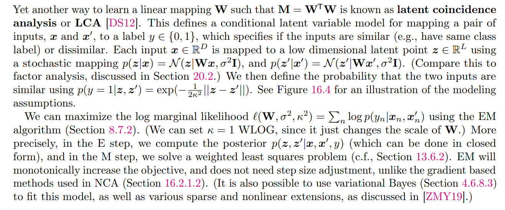

# Nonparametric Models

## 0. Table of Contents

- [1. Exemplar-based Methods](#1-exemplar-based-methods)
    - [1.1. K nearest neighbor (KNN) classification](#11-k-nearest-neighbor-knn-classification)
        - [1.1.1. The curse of dimensionality](#111-the-curse-of-dimensionality)
        - [1.1.2. Reducing the speed and memory requirements](#112-reducing-the-speed-and-memory-requirements)
        - [1.1.3. Open set recognition](#113-open-set-recognition)
    - [1.2. Learning distance metrics](#12-learning-distance-metrics)
        - [1.2.1. Linear and convex methods](#121-linear-and-convex-methods)
        - [1.2.2. Neighborhood components analysis](#122-neighborhood-components-analysis)
        - [1.2.3. Latent coincidence analysis](#123-latent-coincidence-analysis)

- [Reference](#reference)

## 1. Exemplar-based Methods

### 1.1. K nearest neighbor (KNN) classification

- The two main parameters in the model are the size of the neighborhood and the distance metric.

#### 1.1.1. The curse of dimensionality

- The main statistical problem with KNN classifiers is that they do not work well with high dimensional inputs, due to the curse of dimensionality.
- The basic problem is that the volume of space grows exponentially fast with dimension, so you might have to look quite far away in space to find your nearest neighbor.
- There are two main solutions to the curse: 
    - Make some assumptions about the form of the function (i.e., use a parametric model), and/or 
    - Use a metric that only cares about a subset of the dimensions

#### 1.1.2. Reducing the speed and memory requirements

- Various heuristic pruning techniques have been proposed to remove points that do not affect the decision boundaries
- Most methods focus on finding the approximate nearest neighbors.
- There are two main classes of techniques, based on partitioning space into regions, or using hashing. 
    - For partitioning methods, one can either use some kind of k-d tree, which divides space into axis-parallel regions, or some kind of clustering method, which uses anchor points. 
    - For hashing methods, locality sensitive hashing (LSH) is widely used, although more recent methods learn the hashing function from data.
    - [FAISS](https://github.com/facebookresearch/faiss)

#### 1.1.3. Open set recognition

- Online learning, OOD detection and open set recognition

### 1.2. Learning distance metrics

#### 1.2.1. Linear and convex methods

#### 1.2.2. Neighborhood components analysis

- Defines the probability that sample $x_i$ has $x_j$ as its nearest neighbor using the linear softmax function:

#### 1.2.3. Latent coincidence analysis

## Reference
- [1] Kevin P. Murphy. 2022. [Probabilistic Machine Learning: An introduction](https://probml.github.io/pml-book/book1.html). MIT Press.