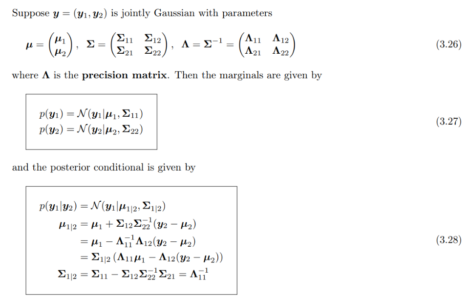

# Topic 1: Probability and Statistics

## 0. Table of Contents

- [1. Univariate Models](#1-univariate-models)
    - [1.1. Univariate Gaussian Distribution](#11-univariate-gaussian-distribution)
    - [1.2. Student's t Distribution](#12-students-t-distribution)
    - [1.3. Cauchy distribution](#13-cauchy-distribution)
    - [1.4. Laplace distribution](#14-laplace-distribution)
    - [1.5. Beta distribution](#15-beta-distribution)
    - [1.6. Gamma distribution](#16-gamma-distribution)
    - [1.7. Transformation of Random Variables](#17-transformation-of-random-variables)
- [2. Multivariate Models](#2-multivariate-models)
    - [2.1. Joint distributions for multiple random variables](#21-joint-distributions-for-multiple-random-variables)
    - [2.2. The multivariate Gaussian (normal) distribution](#22-the-multivariate-gaussian-normal-distribution)
    - [2.3. Linear Gaussian systems](#23-linear-gaussian-systems)
- [3. Fisher Information](#3-fisher-information)
    - [3.1. Definition and Properties](#31-definition-and-properties)
    - [3.2. The Information Inequality](#32-the-information-inequality)
    - [3.3. Efficient Estimators](#33-efficient-estimators)
    - [3.4. Properties of Maximum Likelihood Estimators for Large Samples](#34-properties-of-maximum-likelihood-estimators-for-large-samples)
    - [3.5. Fisher Information for Multiple Parameters](#35-fisher-information-for-multiple-parameters)

- [Reference](#reference)

## 1. Univariate Models

### 1.1. Univariate Gaussian Distribution

- Dirac delta function:

### 1.2. Student's t Distribution

- Student's t distribution:

- We see that the probability density decays as a polynomial function of the squared distance from the center, as opposed to an exponential function, so there is more probability mass in the tail than with a Gaussian distribution. We say that the Student distribution has heavy tails, which makes it robust to outliers. 

### 1.3. Cauchy distribution

### 1.4. Laplace distribution

### 1.5. Beta distribution

### 1.6. Gamma distribution

### 1.7. Transformation of Random Variables 

## 2. Multivariate Models

### 2.1. Joint distributions for multiple random variables 

### 2.2. The multivariate Gaussian (normal) distribution

- Can be used for missing value imputation.

### 2.3. Linear Gaussian systems

### 2.4. Mixture of Models

- Gaussian Mixture Model (GMM): If we let the number of mixture
components grow sufficiently large, a GMM can approximate any smooth distribution

## 3. Fisher Information

### 3.1. Definition and Properties

- Definition:

- Properties:

- __The Fisher Information in a Random Sample:__ When we have a random sample from a distribution, the Fisher information is defined in an analogous manner.

### 3.2. The Information Inequality

- Cramer-Rao (Information) Inequality

- Cramer-Rao Lower Bound on the Variance of an Unbiased Estimator

### 3.3. Efficient Estimators

- Definition:

- In other words, if $T$ is an efficient estimator of $m(\theta)$, then among all unbiased estimators of $m(\theta)$, $T$ will have the smallest variance for every possible value of $\theta$.

### 3.4. Properties of Maximum Likelihood Estimators for Large Samples

- Asymtotic Distribution of an Efficient Estimator:

- Asymptotic Distribution of M.L.E

- It is said that $\hat\theta_n$ is an asymptotically efficient estimator.

### 3.5. Fisher Information for Multiple Parameters

- Fisher Information for a Vector Parameter:

## Reference

- [1] Kevin P. Murphy. 2022. Probabilistic Machine Learning: An introduction. MIT Press.
- [2] DeGroot, Morris H. and Schervish, Mark J. 2002. Probability and Statistics. 3rd ed. Addison Wesley.

