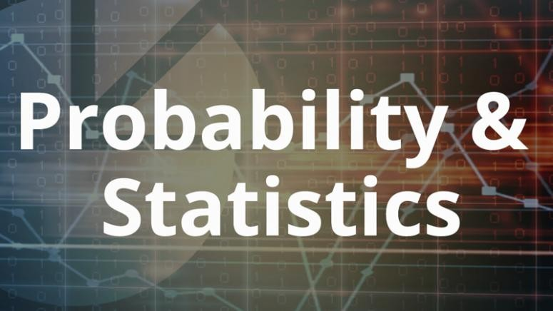
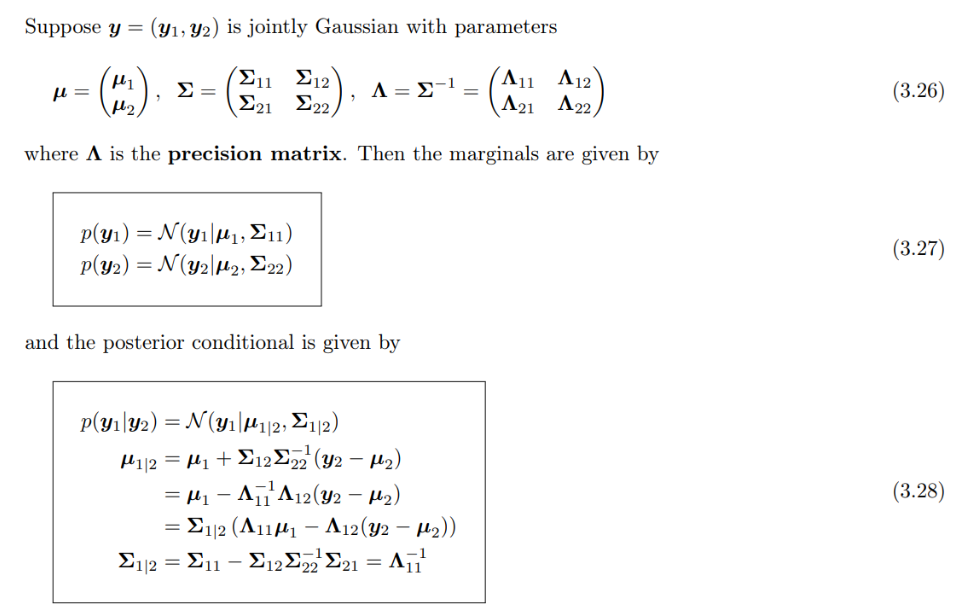

# Probability and Statistics

## 0. Table of Contents

- [1. Univariate Models](#1-univariate-models)
    - [1.1. Univariate Gaussian Distribution](#11-univariate-gaussian-distribution)
    - [1.2. Student's t Distribution](#12-students-t-distribution)
    - [1.3. Cauchy distribution](#13-cauchy-distribution)
    - [1.4. Laplace distribution](#14-laplace-distribution)
    - [1.5. Beta distribution](#15-beta-distribution)
    - [1.6. Gamma distribution](#16-gamma-distribution)
    - [1.7. Transformation of Random Variables](#17-transformation-of-random-variables)
- [2. Multivariate Models](#2-multivariate-models)
    - [2.1. Joint distributions for multiple random variables](#21-joint-distributions-for-multiple-random-variables)
    - [2.2. The multivariate Gaussian (normal) distribution](#22-the-multivariate-gaussian-normal-distribution)
    - [2.3. Linear Gaussian systems](#23-linear-gaussian-systems)
- [3. Fisher Information](#3-fisher-information)
    - [3.1. Definition and Properties](#31-definition-and-properties)
    - [3.2. The Information Inequality](#32-the-information-inequality)
    - [3.3. Efficient Estimators](#33-efficient-estimators)
    - [3.4. Properties of Maximum Likelihood Estimators for Large Samples](#34-properties-of-maximum-likelihood-estimators-for-large-samples)
    - [3.5. Fisher Information for Multiple Parameters](#35-fisher-information-for-multiple-parameters)
- [4. Categorical Data and Nonparametric Methods](#4-categorical-data-and-nonparametric-methods)
    - [4.1. Tests of Goodness of Fit](#41-tests-of-goodness-of-fit)
    - [4.2. Tests of Homogeneity](#41-tests-of-homogeneity)
    - [4.3. Robust Estimation](#43-robust-estimation)

- [Reference](#reference)

## 1. Univariate Models

### 1.1. Univariate Gaussian Distribution

- Dirac delta function:

### 1.2. Student's t Distribution

- Student's t distribution:

- We see that the probability density decays as a polynomial function of the squared distance from the center, as opposed to an exponential function, so there is more probability mass in the tail than with a Gaussian distribution. We say that the Student distribution has heavy tails, which makes it robust to outliers. 

### 1.3. Cauchy distribution

### 1.4. Laplace distribution

### 1.5. Beta distribution

### 1.6. Gamma distribution

### 1.7. Transformation of Random Variables 

## 2. Multivariate Models

### 2.1. Joint distributions for multiple random variables 

### 2.2. The multivariate Gaussian (normal) distribution

- Can be used for missing value imputation.

### 2.3. Linear Gaussian systems

### 2.4. Mixture of Models

- Gaussian Mixture Model (GMM): If we let the number of mixture
components grow sufficiently large, a GMM can approximate any smooth distribution

## 3. Fisher Information

### 3.1. Definition and Properties

- Definition:

- Properties:

- __The Fisher Information in a Random Sample:__ When we have a random sample from a distribution, the Fisher information is defined in an analogous manner.

### 3.2. The Information Inequality

- Cramer-Rao (Information) Inequality

- Cramer-Rao Lower Bound on the Variance of an Unbiased Estimator

### 3.3. Efficient Estimators

- Definition:

- In other words, if $T$ is an efficient estimator of $m(\theta)$, then among all unbiased estimators of $m(\theta)$, $T$ will have the smallest variance for every possible value of $\theta$.

### 3.4. Properties of Maximum Likelihood Estimators for Large Samples

- Asymtotic Distribution of an Efficient Estimator:

- Asymptotic Distribution of M.L.E

- It is said that $\hat\theta_n$ is an asymptotically efficient estimator.

### 3.5. Fisher Information for Multiple Parameters

- Fisher Information for a Vector Parameter:

## 4. Categorical Data and Nonparametric Methods

### 4.1. Tests of Goodness of Fit

- __The Chi-Squared Test of Goodness of Fit:__

- For $i = 1,...,k,$ we shall let $N_i$ denote the number of observations in the random sample that are of type $i$.

- Chi-Squared Statistic:

- __Testing Hypotheses about a Continuous Distribution:__

- __Composite Null Hypotheses:__

- __The Chi-Squared Test for Composite Null Hypotheses:__

- To determine the number of degrees of freedom, we must subtract $s$ from the number $k − 1$ because we are now estimating the $s$ parameters $\theta_1, \theta_2, ..., \theta_s$.

### 4.2. Tests of Homogeneity

- Consider a problem in which random samples are taken from $R$ different populations, and each observation in each sample can be classified as one
of $C$ different types. Thus, the data obtained from the R samples can be represented in an $R \times C$ table.
- For $i = 1,...,R,$ and $j = 1,...,C,$ we shall let $p_{ij}$ denote the
probability that an observation chosen at random from the $i$ th population will be of type $j$.

- __The Chi-Squared Test of Homogeneity:__

- Statistic Q will have approximately the Chi-squared distribution with $(R − 1)(C − 1)$ degrees of freedom

- __Note__: The Chi-squared test of homogeneity is a special case of the Chi-squared test of independence: First, consider the situation in which one sample is drawn and the random variables corresponding to rows and columns are measured. Independence of the row and column variables is equivalent to the conditional distribution of the column variable given a value of the row variable being the same for every value of the row variable. Hence, the test of independence tests that the conditional distributions of the column variable are the same for each value of the row variable. Next, think of the row variable as defining subpopulations. The conditional distributions of the column variable given each value of the row variable are the distributions of the column variable within each subpopulation. The test of homogeneity tests that the distributions within the subpopulations are the same if the samples had been drawn separately from each subpopulation rather than drawn at random from the entire population.

### 4.3. Robust Estimation

-  An estimator that performs well for several different types of distributions, even though it may not be the best available estimator for any particular type of distribution, is called a robust estimator.

- __Contaminated Normal Distributions:__

- __Trimmed Means:__

- __Robust Estimation of Scale:__ 
    - An arbitrary parameter $\sigma$ is a scale parameter for the distribution of $X$ if, for all $a > 0$ and all real $b$, the corresponding parameter for the distribution of $aX + b$ is $a\sigma$.
    - _Median Absolute Deviation_. The median absolute deviation of a random variable $X$ is the median of the distribution of $|X − m|,$ where $m$ is the median of $X$.

- __M-Estimators of the Median:__ The M.L.E. of $\theta$ under the assumption that the data have p.d.f. $g_k(x | \theta, \sigma) = c_ke^{h_k(|x - \theta| / \sigma)}$  is called an M-estimator.

## Reference

- [1] Kevin P. Murphy. 2022. Probabilistic Machine Learning: An introduction. MIT Press.
- [2] DeGroot, Morris H. and Schervish, Mark J. 2002. Probability and Statistics. 3rd ed. Addison Wesley.

